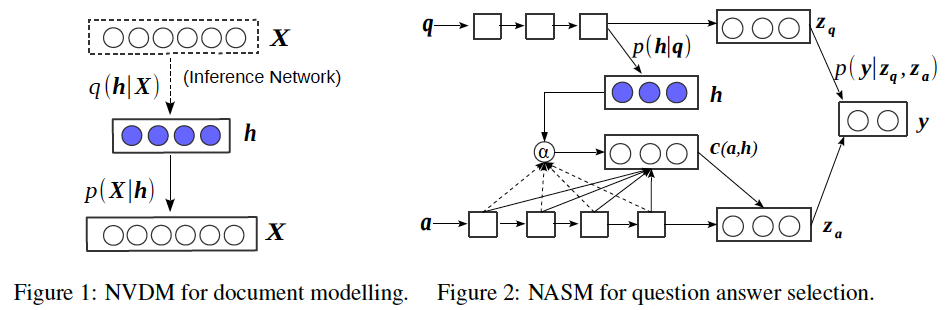
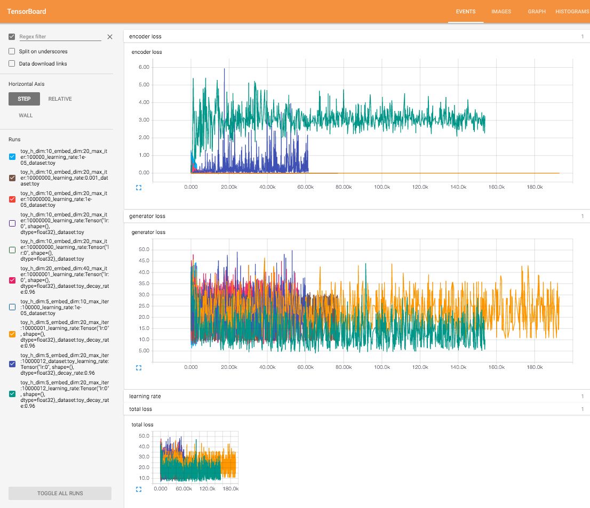
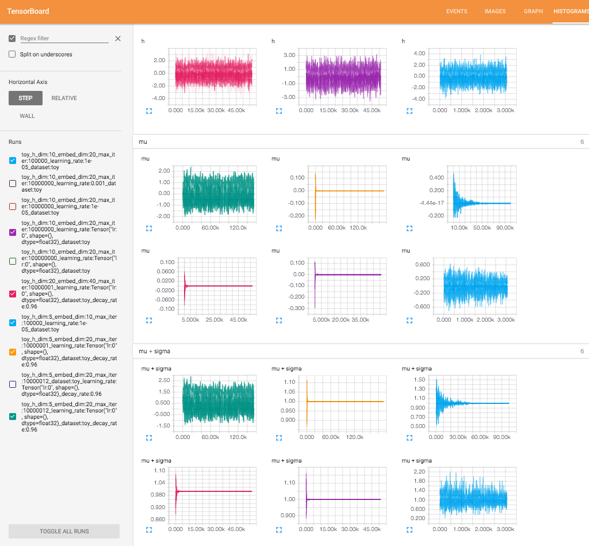

Neural Variational Document Model
=================================

Tensorflow implementation of [Neural Variational Inference for Text Processing](http://arxiv.org/abs/1511.06038).

This implementation contains:

1. Neural Variational Document Model
    - Variational inference framework for generative model of text
    - Combines a stochastic document representation with a bag-of-words generative model 
2. Neural Answer Selection Model (in progress)
    - Variational inference framework for conditional generative model of text
    - Combines a LSTM embeddings with an attention mechanism to extract the semantics between question and answer

Prerequisites
-------------

- Python 2.7 or Python 3.3+
- [NLTK](http://www.nltk.org/)
- [TensorFlow](https://www.tensorflow.org/)

Usage
-----

To train a model with Penn Tree Bank dataset:

    $ python main.py --dataset ptb

To test an existing model:

    $ python main.py --dataset ptb --forward_only True

Results
-------

Training details of NVDM. The best result can be achieved by onehost updates, not alternative updates.

Author
------

Taehoon Kim / [@carpedm20](http://carpedm20.github.io/)
